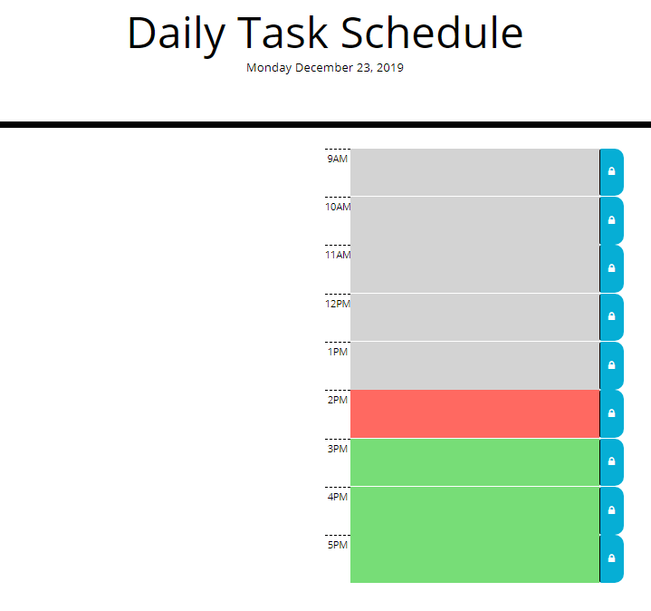

# Work Day Scheduler (Homework5)

This application is simple schedule app that allows the user to schedule items in 1 hour time slots from
9AM to 5PM.  

The app has the following functionality:
 1. Creates a new schedule every day.
 2. Color codes the hour blocks for past, present & future. (A timer is set to update the colors every minute.)
 3. Scheduled items are stored to local storage to allow the user to open & close the app without losing data. 

The application is located here: [Daily Task Schedule](https://rcavalero.github.io/dailytasks/) 

The application consists of one page:

 

## Built With

* This application was built using HTML, JavaScript, jQuery, Bootstrap CSS Framework & some additional CSS styling.

## Authors

* **Robert Cavalero** - *Initial work* - [RCavalero](https://github.com/rcavalero)
